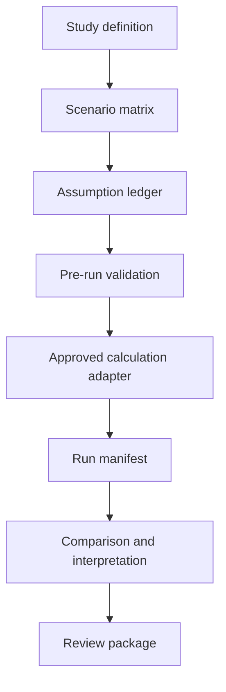

# Architecture

## Design goal

Provide a small, local-first orchestration layer that makes future-oriented LCA assumptions, scenario differences, validation, and review evidence explicit while leaving numerical LCA calculations to an approved adapter.

## Components

| Component | Responsibility | Phase 1 implementation |
|---|---|---|
| Domain models | Project, scenario, choice, transformation, inventory item | Typed dataclasses with stable JSON representation |
| Unit registry | Fail-closed checks for demo units | Small tested registry; extend only with evidence |
| Validation service | Structural, temporal, provenance, approval gates | Offline validator with actionable codes |
| Synthetic adapter | Deterministic original demo arithmetic | Implemented |
| openLCA adapter | IPC connectivity and later descriptor/calculation calls | Safe endpoint probe + JSON-RPC payload builder |
| Prospective background adapter | premise/Brightway metadata and later generation | Readiness boundary; no licensed data |
| Manifest service | Input, assumptions, outputs, environment fingerprints | Implemented |
| Reporting | Study brief / technical report + original HTML / CSV / JSON | Implemented; preserved display fixture, credit/order diagnostics |
| Package verification | Source recalculation and output fingerprints | Implemented; ZIP records exact source revision |
| Local UI | Browser-readable report/dashboard | Static self-contained dashboard served locally |
| CLI | Automation and reproducibility | Implemented |

## Data flow

## Adapter contract

All adapters should eventually expose:

1. capability discovery;
2. approved model/database descriptor resolution;
3. deterministic calculation request;
4. result extraction with units and method metadata;
5. transformation/diff report;
6. source-data and licence metadata;
7. actionable failure states.

The synthetic route implements the calculation/export slice; capability discovery and real model/database descriptor resolution remain outside it. openLCA and premise are intentionally not presented as complete until a safe, approved test database is available.

## Why local-first

Local-first keeps confidential or licensed data on the approved system, makes offline tests possible, avoids telemetry, and is compatible with a researcher running openLCA locally. A cloud/multi-user service can be considered only after the local workflow and governance are accepted.
